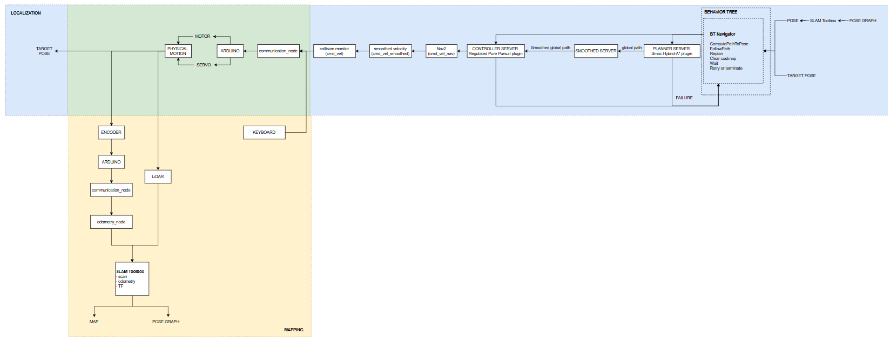
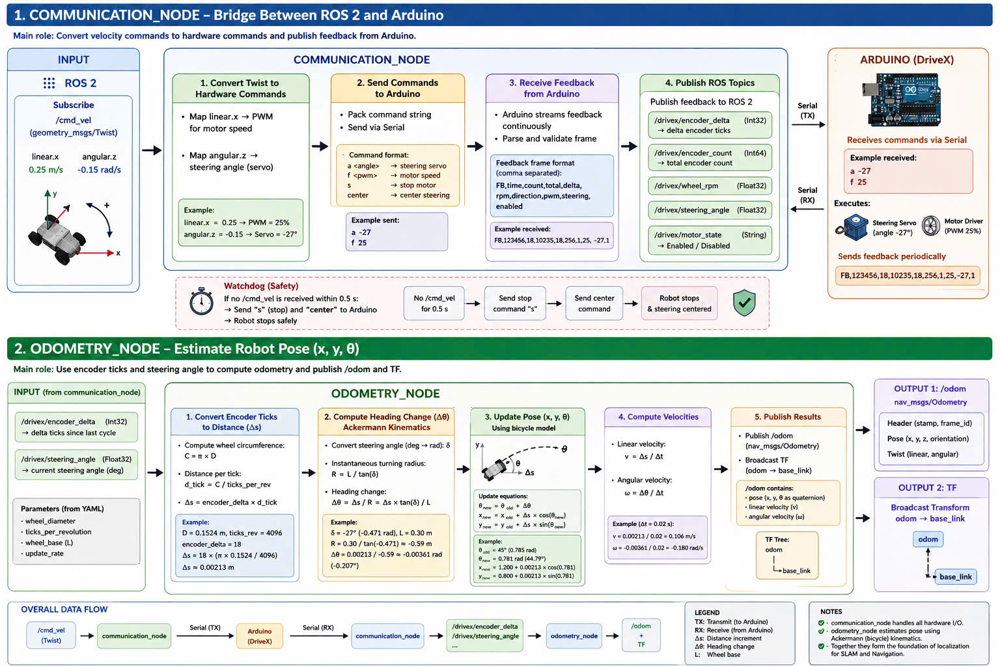
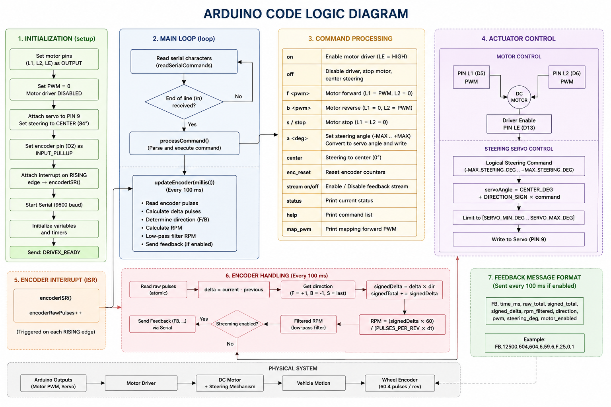
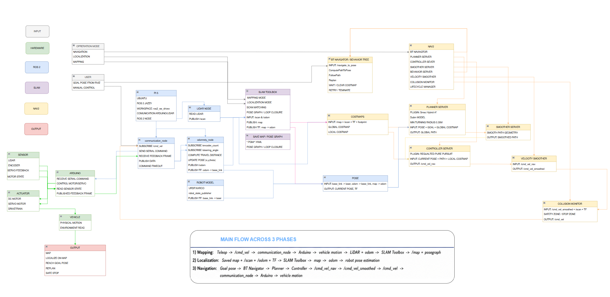

# DriveX Autonomous Vehicle and V2X Research Platform

**ROS 2 · Nav2 · LiDAR · Raspberry Pi 5 · Arduino · Ackermann Control · V2I/V2V · Cooperative Autonomy**

DriveX is a physical autonomous-vehicle research platform developed to study **Ackermann mobile robotics, ROS 2-based autonomous navigation, connected autonomous systems, and V2X-assisted cooperative autonomy**.

The platform integrates low-level embedded vehicle control with LiDAR-based localization, autonomous navigation, path planning, path tracking, encoder odometry, RSU-assisted V2I information, and experimental performance evaluation.

The current system has been experimentally validated on a physical indoor Ackermann-steering vehicle. A second DriveX vehicle has also been built, and the platform is being extended toward **two-vehicle V2V/V2I cooperative-autonomy experiments** with communication-degradation analysis and runtime-safety supervision.

> [!NOTE]
> **Development Status**
>
> The physical autonomous-navigation platform and RSU-assisted V2I pipeline are implemented. V2V state/intention exchange, cooperative decision logic, communication-degradation experiments, and the V2X-aware runtime-safety supervisor remain under active development.

---

## Research Objectives

- Develop reliable autonomous navigation for a physical Ackermann-steering vehicle.
- Integrate RSU-provided V2I information with onboard ROS 2 perception and decision logic.
- Extend the platform to two autonomous vehicles for V2V state and intention exchange.
- Investigate cooperative decision-making and multi-vehicle coordination.
- Quantitatively evaluate V2X communication latency, information freshness, and packet loss.
- Study autonomous-system behavior under communication delay and degraded information availability.
- Develop and evaluate runtime-safety mechanisms for nominal and communication-degraded operating conditions.

---

## System Overview

DriveX combines embedded vehicle control, autonomous navigation, and connected-autonomy functions.



*Figure 1. Overall DriveX system flow integrating embedded vehicle control, autonomous navigation, and connected V2X functions.*

### Embedded Vehicle Layer

- Motor actuation and front steering control
- Wheel-encoder acquisition
- Arduino-based low-level control
- Raspberry Pi 5 to Arduino communication
- Command timeout and embedded watchdog safety

### Autonomous Navigation Layer

- ROS 2 and Nav2
- SLAM Toolbox
- 2D LiDAR-based mapping and localization
- TF-based coordinate transformations
- Costmap-based obstacle representation
- Smac Hybrid-A* path planning
- Regulated Pure Pursuit path tracking
- Encoder-based odometry

### Connected Autonomy Layer

- RSU-assisted V2I information
- TCP/IP communication over Wi-Fi
- Timestamp-based message freshness checking
- Infrastructure information integrated with onboard decision logic
- V2V state and intention exchange **(in development)**
- Cooperative decision-making **(in development)**
- Communication-degradation evaluation **(planned / in development)**
- V2X-aware runtime-safety supervision **(in development)**

---

## Personal Contributions

My primary contributions to DriveX include:

- Physical Ackermann-vehicle system integration.
- Raspberry Pi 5 and Arduino communication architecture.
- Low-level motor and steering integration.
- Encoder-based odometry development and calibration.
- Steering and vehicle-motion calibration.
- ROS 2 integration and system bring-up.
- SLAM Toolbox mapping and localization.
- Nav2 configuration for Ackermann autonomous navigation.
- Smac Hybrid-A* and Regulated Pure Pursuit integration and tuning.
- LiDAR-based obstacle representation and navigation validation.
- Physical testing and quantitative odometry evaluation.
- Development of the RSU-to-vehicle V2I information pipeline.
- Timestamp and message-freshness handling for infrastructure information.
- Ongoing development of V2V communication, cooperative autonomy, and communication-aware runtime safety.

---

## Hardware Platform

| Component | Implementation |
| --- | --- |
| Vehicle configuration | Ackermann-steering mobile robot |
| High-level computer | Raspberry Pi 5 |
| Low-level controller | Arduino Uno R3 |
| Main perception sensor | 2D LiDAR |
| Motion feedback | Wheel encoder |
| Steering | Servo-based front steering |
| Vehicle actuation | Rear-wheel drive |
| Infrastructure | Roadside Unit (RSU) |
| Communication | TCP/IP over Wi-Fi |
| Experimental platform | Two physical DriveX vehicles |

---

## Software Architecture

The DriveX software architecture separates high-level autonomous decision-making from low-level vehicle actuation.



*Figure 2. DriveX ROS 2 system-node architecture and communication structure.*

```text
                    Roadside Unit
                         |
                  TCP/IP over Wi-Fi
                         |
                         v
                  V2I Interface
                         |
                         v
              +----------------------+
              |    ROS 2 Vehicle     |
              |                      |
              |  Localization        |
              |  Nav2                |
              |  Path Planning       |
              |  Path Tracking       |
              |  V2I Decision Logic  |
              |  Baseline Safety     |
              |                      |
              |  Runtime-Safety      |
              |  Supervisor          |
              |  [in development]    |
              +----------+-----------+
                         |
                         v
                  Arduino Control
                         |
                         v
                  Motor / Steering
```

The platform is being extended toward a two-vehicle V2X architecture:

```text
        +-----------+               +-----------+
        |   DX01    | <--- V2V ---> |   DX02    |
        +-----------+               +-----------+
              ^                           ^
              |                           |
              +----------- RSU -----------+
                          V2I
```

---

## Autonomous Navigation

DriveX uses a ROS 2-based autonomous-navigation stack implemented and tested on the physical Ackermann vehicle.

### Mapping and Localization

- SLAM Toolbox
- 2D LiDAR
- ROS 2 TF transformations
- Map generation and saved-map localization
- Encoder odometry as vehicle-motion input

### Path Planning

DriveX uses **Smac Hybrid-A*** for path planning. Hybrid-A* is appropriate for the platform because the vehicle is subject to Ackermann steering and nonholonomic motion constraints, so heading and turning feasibility must be considered when generating paths.

### Path Tracking

The vehicle uses **Regulated Pure Pursuit** for low-speed indoor path tracking under Ackermann steering constraints.

The navigation stack integrates global planning, map-based localization, local obstacle representation, vehicle footprint modeling, costmap-based navigation, LiDAR obstacle detection, replanning, and goal-oriented autonomous navigation.

---

## Vehicle Control and Odometry

Low-level vehicle control is implemented using an Arduino-based embedded controller interfaced with the Raspberry Pi 5 ROS 2 computer.



*Figure 3. Arduino low-level control logic for motor actuation, steering control, encoder acquisition, and vehicle-motion execution.*

The vehicle-control system includes motor actuation, steering control, encoder acquisition, encoder-based odometry, steering calibration, wheel-motion calibration, vehicle-motion parameter calibration, communication timeout handling, embedded watchdog protection, and physical experimental validation.

### Selected Odometry Results

| Experiment | Result |
| --- | ---: |
| Forward-distance odometry error | ~0.72% |
| Reverse-distance odometry error | ~0.13% |
| Experimental platform | Physical Ackermann vehicle |
| Localization framework | SLAM Toolbox |
| Path planner | Smac Hybrid-A* |
| Path-tracking controller | Regulated Pure Pursuit |

These results were obtained from physical vehicle experiments rather than simulation-only evaluation.

---

## V2I Communication

DriveX includes an implemented **RSU-assisted V2I pipeline** for infrastructure-aware autonomous driving.



*Figure 4. DriveX data-flow architecture showing information exchange between the Roadside Unit, ROS 2 vehicle system, and onboard decision layers.*

The current implementation:

- Transmits timestamped intersection information from the Roadside Unit.
- Uses TCP/IP communication over Wi-Fi.
- Checks message freshness before infrastructure information is accepted for use.
- Integrates valid infrastructure information with onboard ROS 2 perception and decision logic.
- Provides information beyond the vehicle's local onboard sensing capability.
- Supports infrastructure-aware autonomous decision-making.

A key architectural principle is that the **RSU provides information to the vehicle decision layer rather than directly controlling the vehicle actuators**. Vehicle-level autonomy therefore remains onboard while infrastructure information augments local perception and decision-making.

---

## V2V and Cooperative Autonomy

The second physical DriveX vehicle has been built. Current development focuses on software and experimental integration for:

- Vehicle-state exchange
- Vehicle-intention exchange
- V2V communication
- Combined V2V/V2I information
- Cooperative intersection behavior
- Communication latency and packet-loss evaluation
- Multi-vehicle coordination
- Safe autonomous decision-making

> **Status:** Under active development.

---

## Safety Architecture

DriveX separates **baseline vehicle safety** from the additional **V2X-aware runtime-safety research layer**.

### Implemented Baseline Safety

- LiDAR-based obstacle-aware navigation
- Costmap-based collision avoidance
- Communication timeout handling
- Embedded Arduino watchdog behavior
- Safe stopping when high-level commands are unavailable or invalid

### V2X-Aware Runtime Safety

An additional runtime-safety supervisor is being developed as an independent mechanism for detecting or preventing unsafe autonomous or cooperative decisions.

Planned evaluation includes unsafe command detection, delayed or stale V2X information, packet loss, communication interruption, safety intervention, and conflicts between nominal autonomy and safety constraints.

> **Status:** Under active development.

---

## Experimental Evaluation

### Completed / Current Evaluation

- Autonomous navigation
- Mapping and localization
- Encoder-odometry accuracy
- Steering and vehicle-motion calibration
- Goal-reaching behavior
- Obstacle response
- RSU-to-vehicle V2I information exchange
- Message timestamp and freshness handling

### Planned V2X Evaluation

- Communication latency
- Message freshness and packet loss
- V2V/V2I information availability
- Coordination success rate
- Intersection conflict behavior
- Vehicle waiting time
- Cooperative decision consistency
- Safety intervention behavior
- Performance under delayed or stale information

---

## Experimental Scenarios

The platform is intended to support controlled comparisons among:

1. Local autonomous driving without V2X assistance.
2. V2I-assisted autonomous driving.
3. V2V-assisted vehicle coordination.
4. Combined V2V and V2I cooperative driving.
5. Communication-delay conditions.
6. Packet-loss conditions.
7. Stale-information conditions.
8. Unsafe or conflicting cooperative decisions.
9. Runtime-safety intervention conditions.

---

## Current Development Status

| Module | Status |
| --- | --- |
| First physical Ackermann vehicle | ✅ Implemented and validated |
| Second physical DriveX vehicle | ✅ Built |
| Raspberry Pi 5 high-level control | ✅ Implemented |
| Arduino low-level vehicle control | ✅ Implemented |
| ROS 2 integration | ✅ Implemented |
| LiDAR integration | ✅ Implemented |
| SLAM mapping | ✅ Implemented |
| Map-based localization | ✅ Implemented |
| Nav2 autonomous navigation | ✅ Implemented |
| Smac Hybrid-A* planning | ✅ Implemented |
| Regulated Pure Pursuit tracking | ✅ Implemented |
| Encoder odometry | ✅ Experimentally validated |
| Steering and motion calibration | ✅ Experimentally validated |
| RSU-assisted V2I pipeline | ✅ Implemented |
| Timestamp/message-freshness handling | ✅ Implemented |
| Baseline timeout/watchdog safety | ✅ Implemented |
| Second-vehicle ROS 2/V2X integration | 🔄 In development |
| V2V state exchange | 🔄 In development |
| V2V intention exchange | 🔄 In development |
| Cooperative decision logic | 🔄 In development |
| V2X-aware runtime-safety supervisor | 🔄 In development |
| Communication-degradation experiments | 🔄 Planned / in development |
| Multi-vehicle quantitative evaluation | 🔄 Planned / in development |

---

## Project Portfolio

Videos, hardware demonstrations, experimental materials, system documentation, and supporting results are available in the DriveX project portfolio:

[**DriveX Project Portfolio**](https://drive.google.com/drive/folders/147Pp82Ls9ovT0m0YNKJmgXiO2AjZyxZU?usp=sharing)

---

## Repository Structure

```text
drivex-v2x-platform/
├── README.md
└── docs/
    └── figures/
        ├── ARDUINO_LOGIC_DIAGRAM.png
        ├── SYSTERM_DATA_FLOW.png
        ├── SYSTERM_FLOW.png
        └── SYSTERM_NODE.jpg
```

---

## Code Availability

This public repository currently provides system documentation, technical architecture, selected diagrams, experiment descriptions, validated results, and project media.

Implementation code associated with ongoing V2X, cooperative-driving, runtime-safety, and publication-related work is currently maintained privately. Selected components may be released progressively following technical validation and review for research, publication, and intellectual-property compatibility.

---

## Technologies

**Robotics and Autonomy**  
ROS 2 · Nav2 · SLAM Toolbox · RViz2 · LiDAR · Smac Hybrid-A* · Regulated Pure Pursuit

**Control and Vehicle Systems**  
Ackermann Steering · Encoder Odometry · Vehicle Motion Modeling · Steering Calibration · Path Tracking · Experimental Validation

**Embedded Systems**  
Raspberry Pi 5 · Arduino Uno R3 · C/C++ · Sensor Integration · Motor Control · Servo Control · Encoder Acquisition

**Connected Autonomous Systems**  
V2I · TCP/IP over Wi-Fi · Timestamp/Freshness Validation · RSU-Assisted Information · V2V Integration *(in development)*

**Research and Analysis**  
MATLAB/Simulink · Ubuntu Linux · Experimental Logging · Quantitative Performance Evaluation

---

## Project Status

DriveX is under continuous development as a physical connected-autonomous-vehicle research platform. The repository will be updated as additional V2X components, experiments, and validated results become suitable for public documentation or release.
